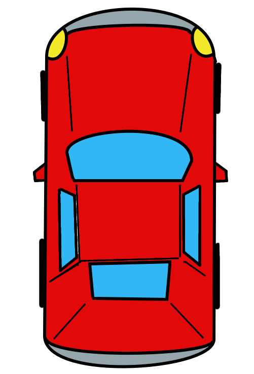

# test is git
## test is git
### test is git
#### test is git
##### test is git
###### test is git

`Code`

```python
{
    name = amir
    age = 19
    print("hello")


}
```
___

## list
1. python
2. django
3. html
4. git 
5. css
___
## list 2
- lists(`python` `css` `html` `django`)
    - git
    - git hub
___
## links
[link in too monogar](https://academy.rayanita.com)

[link in too monogar](https://academy.rayanita.com)

## imgs


